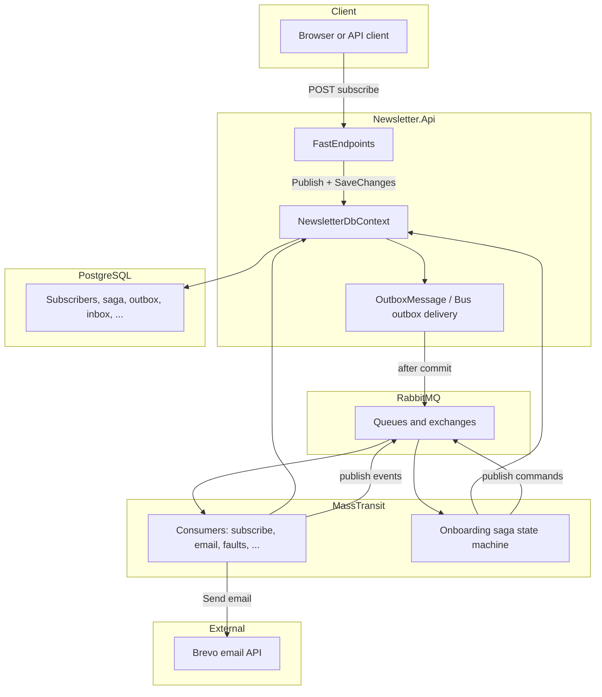
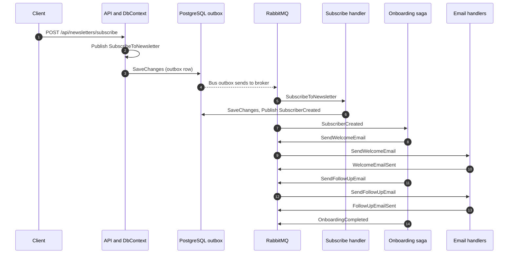
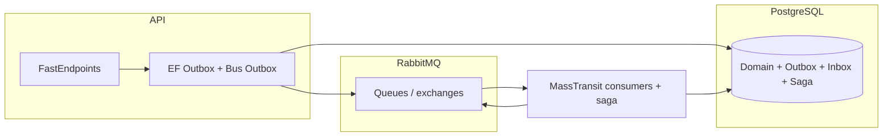

# Newsletter.Api

## Overview

A .NET 10 Web API that demonstrates **event-driven** newsletter onboarding using **FastEndpoints**, **MassTransit** with **RabbitMQ**, **EF Core** (PostgreSQL), and a **MassTransit saga** for orchestration. It includes the **transactional outbox** pattern, **inbox** support, **RabbitMQ resilience** (retry and circuit breaker), and a small **static dashboard** (`wwwroot/index.html`) for visualizing test messages and subscriber progress. To see how it works, please visit the link https://tdp-newsletter-api-jdlq9.ondigitalocean.app/

---

## How to read the flow below

1. Start with **Onboarding happy path (numbered)** for a plain-English timeline.
2. Use **Vertical flow (one picture)** to see direction: API, database, broker, saga, consumers.
3. Use **Sequence diagram** if you care about *order* and *who talks to whom*.
4. Use **Fault tolerance and consistency** for mechanisms and config keys.

---

## Onboarding happy path (subscribe)

These steps are the main **business flow** after `POST /api/newsletters/subscribe`:

| Step | What happens | Message / state |
|------|----------------|-----------------|
| 1 | API publishes `SubscribeToNewsletter` and **SaveChanges** so the **outbox** commits with the HTTP request. | Command in outbox, then to RabbitMQ |
| 2 | `SubscribeToNewsletterHandler` inserts `Subscriber` (Pending), publishes `SubscriberCreated`, **SaveChanges**. | Subscriber row + outbox |
| 3 | **Saga** receives `SubscriberCreated`, (optional demo delay), publishes `SendWelcomeEmail`. | Saga state: Welcoming |
| 4 | `SendWelcomeEmailHandler` sends email, publishes `WelcomeEmailSent`. | Subscriber: Welcoming |
| 5 | Saga publishes `SendFollowUpEmail`. | Saga: FollowingUp |
| 6 | `SendFollowUpEmailHandler` sends email, publishes `FollowUpEmailSent`. | Subscriber: FollowingUp |
| 7 | Saga publishes `OnboardingCompleted`, **Finalize** (saga row removed when complete). | Subscriber: Completed |

If a command fails repeatedly, MassTransit can emit **`Fault<T>`**; the saga moves to **Faulted** and subscribers can show **Faulted** in the UI.

---

## Vertical flow (one picture)

Read **top to bottom**: request enters the API, data and outbox are committed together, RabbitMQ moves messages, consumers and the saga run, and email handlers talk to Brevo.



---

## Sequence diagram (order of calls)

Shows **outbox first**, then **subscribe handler**, then **saga** and **email handlers** exchanging commands and events through RabbitMQ.



---

## Architecture (components only)

Compact view of **who talks to what** (no step order).



---

## Fault tolerance and consistency

This section describes **what this repository configures**, not every MassTransit option.

### Consistency

| Mechanism | What it does here |
|-----------|-------------------|
| **Transactional outbox** (`AddEntityFrameworkOutbox` + `UseBusOutbox`) | Outgoing publishes/sends tied to `NewsletterDbContext` are stored in **`OutboxMessage`** and reach RabbitMQ only after **`SaveChanges`** succeeds. |
| **Inbox** (`AddInboxStateEntity`) | Helps avoid duplicate processing when RabbitMQ **redelivers** the same message. |
| **Saga persistence** (EF repository, PostgreSQL, pessimistic concurrency) | Onboarding state survives restarts and is updated under **locking**. |
| **Subscriber onboarding fields** | `OnboardingStatus`, `OnboardingCompletedAtUtc`, `OnboardingFaultReason` remain on **`Subscribers`** after the saga instance is completed. |

### Fault tolerance

| Mechanism | What it does here |
|-----------|-------------------|
| **Message retry** (`UseMessageRetry`) | Retries consumer handling a few times with a short interval for **transient** errors. After retries exhaust, typed faults (e.g. `Fault<SendFollowUpEmail>`) are published so the saga and fault handlers run promptly. Host-level delayed redelivery is not used here because it defers fault publication until long after the last delayed attempt. |
| **Circuit breaker** (`UseCircuitBreaker`) | Backs off when failure rates are high. |
| **Saga fault events** (`Fault<SendWelcomeEmail>`, `Fault<SendFollowUpEmail>`) | Saga moves to **Faulted**; handlers can update **Subscriber** for visibility. |
| **RabbitMQ** | **At-least-once** delivery; combined with inbox/retry/redelivery, the system tolerates duplicates and transient failures better. |

### HTTP exception handling

- Global API exception handling is registered via `UseGlobalExceptionHandling()` in `Program.cs`.
- Implementation lives in `Extensions/ExceptionHandlingExtensions.cs`.
- Unhandled HTTP exceptions are logged and returned as **Problem Details** (`500`).
- Error detail is returned only in Development.

### Configuration

- **`ConnectionStrings:Database`** - PostgreSQL for EF Core (domain, outbox, inbox, saga).
- **`ConnectionStrings:RabbitMQ`** - RabbitMQ URI (`amqp://` or `amqps://`).
- **`Newsletter:Onboarding:StepDelayMilliseconds`** - Optional delay between saga steps (demos and UI).
- **`Brevo`** - Transactional email API (`BrevoOptions`).

---

## Requirements

- .NET 10 SDK
- PostgreSQL (connection string in `appsettings.*.json`)
- RabbitMQ (AMQP/AMQPS)
- Optional: Visual Studio 2026 for development and debugging

## Database and migrations

EF Core `NewsletterDbContext`. Apply migrations:

```bash
dotnet ef database update --project src/Newsletter.Api
```

## Running the API

- Development launch profiles (typical): HTTP `http://localhost:5264`, HTTPS `https://localhost:7027`
- Open the root URL for the **dashboard** (test queue + subscribers + progress).
- Swagger UI is available at the app root in Development.

## HTTP endpoints (current)

| Method | Path | Purpose |
|--------|------|---------|
| POST | `/api/newsletters/subscribe` | Body `{ "email": "..." }` - starts subscribe and onboarding saga (outbox + MassTransit). |
| POST | `/api/newsletters/test` | Test pipeline / outbox demo with a track id. |
| GET | `/api/newsletters/test-messages` | Recent test send rows (dashboard). |
| GET | `/api/newsletters/subscribers` | Recent subscribers and onboarding fields (dashboard). |
| GET | `/api/newsletters/onboarding-settings` | Step delay (ms) for UI hint. |
| GET | `/api/newsletters/info` | Simple newsletter info string. |

MassTransit configuration (consumers, saga, outbox, RabbitMQ policies) lives in `Features/Newsletters/Extensions/ConfigurationExtensions.cs`.
